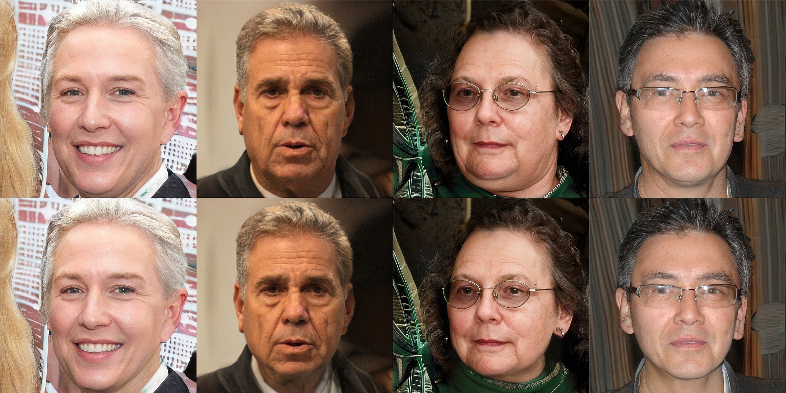

# chin-editing-dataset



chin-editing-dataset is a high-quality image dataset of double chin editing, based on [StyleGAN2](https://github.com/NVlabs/stylegan2).

The dataset is built by our diffusion method(See the Section3.4 in our paper)

> **Coarse-to-Fine: Facial Structure Editing of Portrait Images via Latent Space Classifications**<br>
> [Yiqian Wu](https://onethousandwu.com/), [Yongliang Yang](http://www.yongliangyang.net/), Qinjie Xiao,[Xiaogang Jin](http://www.cad.zju.edu.cn/home/jin)*.<br>ACM Transactions on Graphics (Proc. of Siggraph'2021), 2021, 40(4): Article 46.


[[paper(high resolution)](https://drive.google.com/file/d/14w9j2w8EoeH7ikD9aljT7JfulPPsvky4/view?usp=sharing)]  

[[paper(low resolution)](https://drive.google.com/file/d/1Kk--kQdCB91QgkmrmOV2OwsoeF05vLr5/view?usp=sharing)]  

[[demo](https://drive.google.com/file/d/1vaohqZ_GqgydIpnVpPv_K-7bl_UW6IyG/view?usp=sharing)]  

[[code](https://github.com/oneThousand1000/Facial-Structure-Editing-of-Portrait-Images-via-Latent-Space-Classifications)]

[[supplementary materials](https://drive.google.com/file/d/14oIdiv2NkvpRYxomDRq0AQEpBuL4pKtv/view?usp=sharing)]

[[project page](https://onethousandwu.com/doublechinremoval.github.io/)]

[[dataset]](https://github.com/oneThousand1000/coarse-to-fine-chin-editing)

We create the first large-scale chin editing dataset to facilitate future research. The dataset contains 14,788 pairs of realistic portrait images at 1024&times;1024 resolution with and without a double chin and their corresponding latent codes. 

All the images are synthetic and generated by StyleGAN2.

## Overview

google drive link of the dataset: https://drive.google.com/drive/folders/10e6WB4YLb3Mn6Us4mPAgBksGr7kBx8q0?usp=sharing

| dir                                                          | information                                                  |
| ------------------------------------------------------------ | ------------------------------------------------------------ |
| ├ [double_chin_pair_psi_0.5](https://drive.google.com/drive/folders/1adQYWNbPeKdWqSCtcDeR0EPEoTcd6jvV?usp=sharing) | data for **truncation_psi-0.5**                              |
| │ ├ [codes](https://drive.google.com/drive/folders/1-9gqOFihd1uxunWMHa2EyBzVCaBoNbu1?usp=sharing) | latent codes.` {img_id}_wp.npy` :  the original latent code, `{img_id}_inverted_WP_codes.npy` : the latent code after removing double chin. |
| │ ├ [diffused](https://drive.google.com/drive/folders/1ANYOzgBS1hfuZQP1lvsbmfi_CHwmCdDt?usp=sharing) | the images that generated directly from `{img_id}_inverted_WP_codes.npy` |
| │ ├ [res](https://drive.google.com/drive/folders/1fuunkAXEFBBISJjGcUD2VGZJ5p4MkCtn?usp=sharing) | results images , `{img_id}.jpg`                              |
| │ └ [origin](https://drive.google.com/drive/folders/1VPeYNsyu8HdTdkd7KvRd_eYskELNr0wa?usp=sharing) | original images, `{img_id}.jpg`                              |
| ├ [double_chin_pair_psi_0.8](https://drive.google.com/drive/folders/1t1YS7Qp0HmGDG980jH6rzGKgGvYUB14Y?usp=sharing) | data for **truncation_psi-0.8**                              |
| │ ├[ codes](https://drive.google.com/drive/folders/1-2zj9T5amUC3fGRqKCfj__ZLtimtO32L?usp=sharing) | latent codes. `{img_id}_wp.npy` : the original latent code, `{img_id}_inverted_wp.npy `: the latent code after removing double chin. |
| │ ├ [res](https://drive.google.com/drive/folders/1OOH0giDNkQ7HEN9Nrmh0uVf_7zbFR0_I?usp=sharing) | results images, `{img_id}.jpg`                               |
| │ └ [origin](https://drive.google.com/drive/folders/1Am8NZbg4GBEf9vqhS3oAjizNSSSFdw8V?usp=sharing) | original images, `{img_id}.jpg`                              |


## Related Works

> **Analyzing and Improving the Image Quality of StyleGAN**<br>
> Tero Karras, Samuli Laine, Miika Aittala, Janne Hellsten, Jaakko Lehtinen, Timo Aila


## Agreement

- The chin-editing-dataset is available for **non-commercial research purposes** only.

## Citation

```
@article{DBLP:journals/tog/WuYX021,
  author    = {Yiqian Wu and
               Yong{-}Liang Yang and
               Qinjie Xiao and
               Xiaogang Jin},
  title     = {Coarse-to-fine: facial structure editing of portrait images via latent
               space classifications},
  journal   = {{ACM} Trans. Graph.},
  volume    = {40},
  number    = {4},
  pages     = {46:1--46:13},
  year      = {2021}
}
```
## Contact

onethousand@zju.edu.cn

onethousand1250@gmail.com
